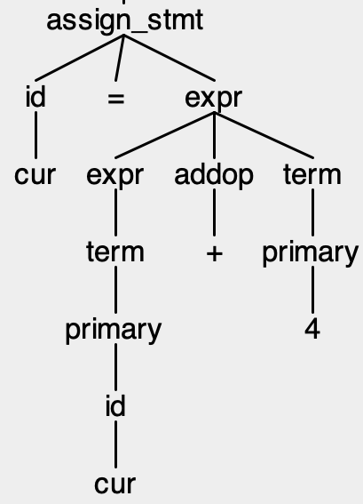

# Step 1: Scanning and Parsing
## Due: Sep 11th, midnight

## Setting up your repository

Set up your GitHub classroom repository for step 1 using the link on Brightspace.

Then clone your repository as directed in the cloning and submitting instructions

## Background

The first phases of a compiler involve recognizing when a program is a valid program: does it use the correct "vocabulary" (keywords, operators, variable names), and does it use proper grammar (do while loops look the way they should, etc.). To do so, a compiler uses two tools:

1. A *scanner* that reads in a stream of characters and *tokenizes* them into the constituent words of the language -- the keywords, operators, variable names, etc.
2. A *parser* that consumes a stream of tokens (as identified by the scanner) into a *parse tree* a representation of the structure of the program.

So, for example, a scanner might convert:

```
cur = cur + 4;
```

into:

```
ID(cur) OP(ASSIGN) ID(cur) OP(PLUS) LIT(4) SEMI
```

In other words, into 6 tokens: an identifier (`cur`), an operator (assignment), an identifier (`cur`), an operator (addition), a constant (`4`), and a semicolon. Note  that the tokens ignore whitespace, and also can collapse multiple characters (e.g., the variable names) into a single token.

The parser, then, converts this stream of tokens into a parse tree that captures its structure. In this case, the tree will look something like this:



This tree may look confusing, but it fundamentally captures the structure of an *assignment statement*: an assignment statement is an *assignment expression* followed by a semicolon. An assignment expression is decomposed into an *identifier* followed by an assignment operation followed by an *expression*. That expression consists of a bunch of sub-expressions that are combined with addition and subtraction, and those sub-expressions are decomposed into a bunch of  *terms* that are combined with multiplication and division (this weird decomposition of expressions captures the necessary order of operations), and so on. Eventually, those *terms* become identifiers or constants.

One important thing to note is that the *leaves* of the tree are the tokens of of the program. If you read the leaves of the tree left to right (ignoring lambdas, since just represent the empty string), you get:

```
[cur] [=] [cur] [+] [4]
```

Which is exactly the tokenization of the input program!

### Regular expressions and Scanner Generators

Tokens in a language are defined using *regular expressions*. These token definitions are used by specialized tools called scanner generators to build scanners (see class notes).

In `MicroC.g4`, towards the bottom, you can see several of the tokens that we have defined for uC, including the definition of identifiers (a letter, followed  by zero or more letters or digits) and integer literals (one or more digits).

```
IDENTIFIER : LETTER (LETTER | DIGIT)* ;

INT_LITERAL : DIGIT+;

...

fragment LETTER : ('a'..'z' | 'A'..'Z') ;

fragment DIGIT : ('0'..'9') ;
```

> Note that ANTLR allows for token definitions to be intermixed with grammar 
> definitions, so many of the tokens in the language, for example keywords, are 
> definned when we define the grammar. See below.

### Context-free grammars

To figure out how each construct in a program (an expression, an if statement, etc.) is decomposed into smaller pieces and, ultimately, tokens, we use a set of rules called a *context-free grammar*. These rules tell us how constructs (which we call "non-terminals") can be decomposed and written in terms of other constructs and tokens (which we call "terminals").

`MicroC.g4` defines the structure of uC (the language we are building a compiler for). Here we can see many of the key components of a grammar definition. For example, this rule say that a program consists of a number of variable declarations followed by a function (`main`):

`program : decls function;`

We can also see how token definitions are integrated into a grammar in two ways. Variable declarations consist of a type (in this version of uC, we only support `int`s) then an identifier, then a semi-colon:

`var_decl : 'int' id ';' ;`

Here we see that some tokens are defined "in-line," like `int` and `;`. On the other hand, `id` is a non-terminnal whose rule refers to the `IDENTIFIER` token:

`id : IDENTIFIER ;`

Note that by convention in ANTLR, non-terminals start with lower case letters, while tokens start with capital letters.

ANTLR lets you define empty rules, which are convenient for defining lists of arbitrary length:

```
statements : statement statements
            | /* empty */ ;
```

So a `statements` non-terminal can expand to a single `statement` followed by more `statements`, or the list can end by rewriting `statements` to the empty string (ANTLR just uses an empty right hand side; we add the comment `/* empty */` to make it easier to see when there is an empty right hand side)

An input program matches the grammar (we say "is accepted by" the grammar) if you can use the rules of the grammar (starting from `program`) to generate the set of tokens that are in the input file. If there is no way to use the rules to generate the input file, then the program does not match the grammar, and hence is not a syntactically valid program.

### ANTLR and Recursive Descent parsers

ANTLR is a tool for building a recursive descent parser (and utlimately a compiler -- see steps 2 and 3) given a grammar and token definitions. An ANTLR "program" is a `.g4` file, as we have given you in your starter code.

To generate a parser, you use ANTLR to translate the `.g4` file into a number of Java files:

```
$ make
rm -rf build
mkdir build
java -cp lib/antlr-4.8-complete.jar org.antlr.v4.Tool -o build MicroC.g4
```

The first `java` command runs ANTLR to generate a number of Java files in `build`:

```
MicroC.interp		MicroCLexer.interp	MicroCListener.java
MicroC.tokens		MicroCLexer.java	MicroCParser.java
MicroCBaseListener.java	MicroCLexer.tokens
```

These include a Java class that is the scanner (`MicroCLexer.java`), and a java class that is the parser (`MicroCParser.java`).

> You can use ANTLR to generate parsers in other languages, like C and Python. 
> You may use these languages in this class, but we will primarily provide 
> support for the ANTLR-to-Java path. In later steps, we will provide 
> substantial amounts of starter code in Java.

`MicroCParser.java` defines a recursive descent parser that parses a stream of tokens. The function `program` builds a parse tree starting with the `program` rule; this function calls other functions, like `decls`, to build subtrees of the parse-tree.

To actually use the parser, the scanner is used to turn an input stream into a stream of tokens. This stream of tokens is then passed to the recursive descent parser to build a parse tree. The file `src/Compiler.java` shows how this is done:

```
MicroCLexer lexer = new MicroCLexer(CharStreams.fromFileName(args[0]));

MicroCParser parser = new MicroCParser(new CommonTokenStream(lexer));

ParseTree pt = parser.program();
```

We can thus compile our newly generated parser and lexer together with our compiler driver (`src/Compiler.java`) to create a program that will parse programs to tell whether they match the grammar or not:

`javac -cp lib/antlr-4.8-complete.jar -d classes src/*.java build/*.java`

And then we can run the program:

```
$ java -cp classes:lib/antlr-4.8-complete.jar Compiler tests/test1.uC
Accepted
```

```
$ java -cp classes:lib/antlr-4.8-complete.jar Compiler tests/test3.uC
Not Accepted
```

> Question: what is wrong with `tests/test3.uC`?

## What you need to do

We want you to add a new control construct to uC: if-then-else statements. The syntax of if-then-elses is the same as in C, though we require that all blocks be delimited with braces:

```
if (x == 0) {
  ...
} else {
  ...
}
```

Remember that the `else` block is optional:

```
if (x == 0) {
  ...
}
```

We have given you the "top level" rule for if statements already, though none of the right hand side of the rule is filled in. Feel free to add token definitions (either inline or otherwise), as well as any other rules you think necessary, to define if-then-elses.

> Hint 1: You can look at how while loops are defined for some ideas about how 
> to set up the conditional for if statements, as well as how to match the 
> braces and put in a block of statements for the body of the construct.

> Hint 2: We suggest defining a separate rule for `else`.

### Sample inputs and outputs

The inputs and outputs we will test your program on can be found [here](testcases/).

A sample compiler (a .jar file that you can invoke with `-jar`) is available [here](step1.jar).

## What you need to submit

* All of the necessary code for building your compiler.

* A Makefile with the following targets:
    1. `compiler`: this target will build your compiler
    2. `clean`: this target will remove any intermediate files that were created to build the compiler

* A shell script (this *must* be written in bash, which is located at `/bin/bash` on the ecegrid machines) called `runme` that runs your scanner. This script should take in two arguments: first, the input file to the compiler  and second, the filename where you want to put the compiler's output. You can assume that we will have run `make clean; make compiler` before running this script, and that we will invoke the script from the root directory of your compiler.

While you may create as many other directories as you would like to organize your code or any intermediate products of the compilation process, both your `Makefile` and your `runme` script should be in the root directory of your repository.

Here is an example of how we will test your compiler:

```
$ make clean; make compiler
rm -rf classes build
rm -rf build
mkdir build
java -cp lib/antlr-4.8-complete.jar org.antlr.v4.Tool -o build MicroC.g4
javac -cp lib/antlr-4.8-complete.jar -d classes src/*.java build/*.java
$ ./runme tests/test1.uc out
$ diff out outputs/test1.expected
$
```


*Do not submit any binaries*. Your git repo should only contain source files; no products of compilation.

See the submission instructions document for instructions on how to submit. You should tag your step 1 submission as `submission`